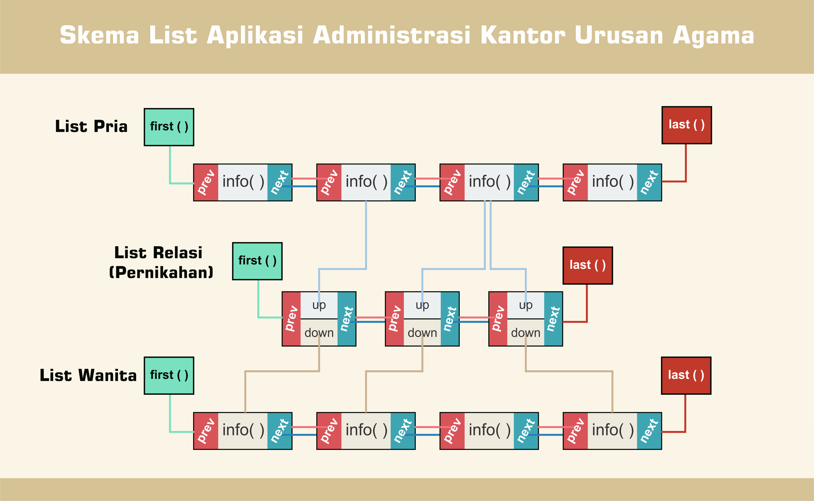

# KUA (Aplikasi Administrasi Kantor Urusan Agama) Adminstration Application
## Introduction
KUA Administration Application is an application for support the KUA data administration process. This application manage data of prospective couples, marriage registration, and divorce registration.

## Scheme
This project implements a linked list data structure with scheme:

 
